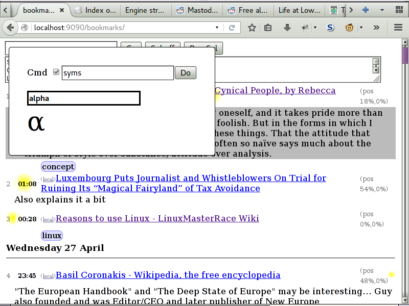
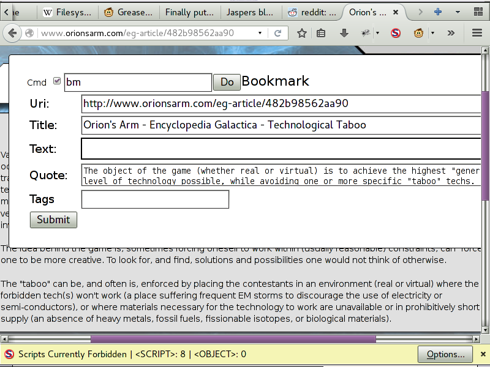

# Html page and asset system
Build from this, and userscripts a bookmarks and history server.

That has been packaged as one bunch at
[ojasper.nl/data/data/page_html_set.lua.0.0.1.tar.gz](http://ojasper.nl/data/page_html_set.lua.0.0.tar.bz2),
there is a
[PKGBUILD](https://github.com/o-jasper/page_html/tree/master/tools/pkg/PKGBUILD).

Some of the apis how to use are in `lib.md`.

### Installing(linux)
In `~/.init.lua`(other whatever initiates lua, add.

    package.path = "$THIS_PROJECT/?.lua;$THIS_PROJECT/?/init.lua;" .. package.path

#### Alternatively:

* Add a `~/.lualibs/`
* Add/edit the `~/.init.lua` adding.

    package.path = "/home/$USER/.lualibs/?.lua;/home/$USER/.lualibs/?/init.lua;"
        .. package.path

Then, symlink this thing to there.

* `cd ~/.lualibs/ ; ln -s path-to-project/html_page/``

#### Dependencies
The different implementations depend on their respective thing.

* Pegagus and [PegasusJs](https://github.com/o-jasper/PegasusJs)
  for the [pegasus](http://evandrolg.github.io/pegasus.lua/) variant.

* Luakit for `luakit_chrome`

## Lua Ring

* [lua_Searcher](https://github.com/o-jasper/lua_Searcher) sql formulator including
  search term, and Sqlite bindings.

* [page_html](https://github.com/o-jasper/page_html) provide some methods on an object,
  get a html page.(with js)

* [storebin](https://github.com/o-jasper/storebin) converts trees to binary, same
  interfaces as json package.(plus `file_encode`, `file_decode`)
  
* [PegasusJs](https://github.com/o-jasper/PegasusJs), easily RPCs javascript to
  lua. In pegasus.

* [tox_comms](https://github.com/o-jasper/tox_comms/), lua bindings to Tox and
  bare bot.

